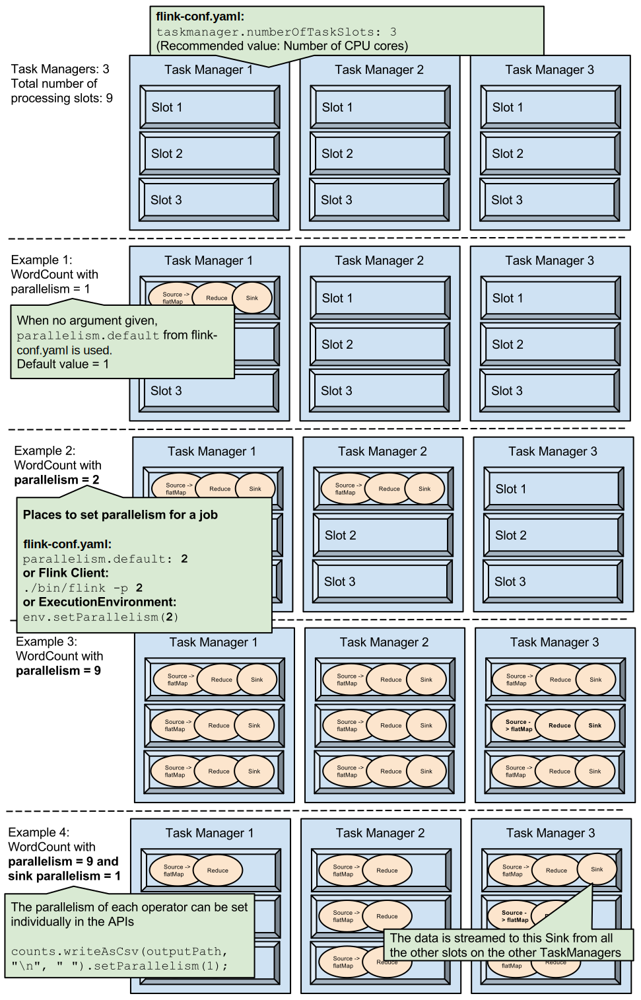

# Configuration

<!--
Licensed to the Apache Software Foundation (ASF) under one
or more contributor license agreements.  See the NOTICE file
distributed with this work for additional information
regarding copyright ownership.  The ASF licenses this file
to you under the Apache License, Version 2.0 (the
"License"); you may not use this file except in compliance
with the License.  You may obtain a copy of the License at

  http://www.apache.org/licenses/LICENSE-2.0

Unless required by applicable law or agreed to in writing,
software distributed under the License is distributed on an
"AS IS" BASIS, WITHOUT WARRANTIES OR CONDITIONS OF ANY
KIND, either express or implied.  See the License for the
specific language governing permissions and limitations
under the License.
-->

**For single-node setups Flink is ready to go out of the box and you don't need to change the default configuration to get started.**

The out of the box configuration will use your default Java installation. You can manually set the environment variable `JAVA_HOME` or the configuration key `env.java.home` in `conf/flink-conf.yaml` if you want to manually override the Java runtime to use.

This page lists the most common options that are typically needed to set up a well performing (distributed) installation. In addition a full list of all available configuration parameters is listed here.

All configuration is done in `conf/flink-conf.yaml`, which is expected to be a flat collection of [YAML key value pairs](http://www.yaml.org/spec/1.2/spec.html) with format `key: value`.

The system and run scripts parse the config at startup time. Changes to the configuration file require restarting the Flink JobManager and TaskManagers.

The configuration files for the TaskManagers can be different, Flink does not assume uniform machines in the cluster.

## Common Options

|	Key	|	Default	|	Description	|
|	--	|	--	|	--	|
|	jobmanager.heap.size	|	"1024m"	|	JVM heap size for the JobManager.	|
|	taskmanager.heap.size	|	"1024m"	|	JVM heap size for the TaskManagers, which are the parallel workers of the system. On YARN setups, this value is automatically configured to the size of the TaskManager's YARN container, minus a certain tolerance value.	|
|	parallelism.default	|	1	|		|
|	taskmanager.numberOfTaskSlots	|	1	|	The number of parallel operator or user function instances that a single TaskManager can run. If this value is larger than 1, a single TaskManager takes multiple instances of a function or operator. That way, the TaskManager can utilize multiple CPU cores, but at the same time, the available memory is divided between the different operator or function instances. This value is typically proportional to the number of physical CPU cores that the TaskManager's machine has (e.g., equal to the number of cores, or half the number of cores).	|
|	state.backend	|	(none)	|	The state backend to be used to store and checkpoint state.	|
|	state.checkpoints.dir	|	(none)	|	The default directory used for storing the data files and meta data of checkpoints in a Flink supported filesystem. The storage path must be accessible from all participating processes/nodes(i.e. all TaskManagers and JobManagers).	|
|	state.savepoints.dir	|	(none)	|	The default directory for savepoints. Used by the state backends that write savepoints to file systems (MemoryStateBackend, FsStateBackend, RocksDBStateBackend).	|
|	high-availability	|	"NONE"	|	Defines high-availability mode used for the cluster execution. To enable high-availability, set this mode to "ZOOKEEPER".	|
|	high-availability.storageDir	|	(none)	|	File system path (URI) where Flink persists metadata in high-availability setups.	|
|	security.ssl.internal.enabled	|	FALSE	|	Turns on SSL for internal network communication. Optionally, specific components may override this through their own settings (rpc, data transport, REST, etc).	|
|	security.ssl.rest.enabled	|	FALSE	|	Turns on SSL for external communication via the REST endpoints.	|

## Full Reference

### HDFS

<div class="alert alert-warning">
  <strong>Note:</strong> These keys are deprecated and it is recommended to configure the Hadoop path with the environment variable <code>HADOOP_CONF_DIR</code> instead.
</div>

These parameters configure the default HDFS used by Flink. Setups that do not specify a HDFS configuration have to specify the full path to HDFS files (`hdfs://address:port/path/to/files`) Files will also be written with default HDFS parameters (block size, replication factor).

- `fs.hdfs.hadoopconf`: The absolute path to the Hadoop File System's (HDFS) configuration **directory** (OPTIONAL VALUE). Specifying this value allows programs to reference HDFS files using short URIs (`hdfs:///path/to/files`, without including the address and port of the NameNode in the file URI). Without this option, HDFS files can be accessed, but require fully qualified URIs like `hdfs://address:port/path/to/files`. This option also causes file writers to pick up the HDFS's default values for block sizes and replication factors. Flink will look for the "core-site.xml" and "hdfs-site.xml" files in the specified directory.

- `fs.hdfs.hdfsdefault`: The absolute path of Hadoop's own configuration file "hdfs-default.xml" (DEFAULT: null).

- `fs.hdfs.hdfssite`: The absolute path of Hadoop's own configuration file "hdfs-site.xml" (DEFAULT: null).

### Core

|	Key	|	Default	|	Description	|
|	--	|	--	|	--	|
|	classloader.parent-first-patterns.additional	|	(none)	|	A (semicolon-separated) list of patterns that specifies which classes should always be resolved through the parent ClassLoader first. A pattern is a simple prefix that is checked against the fully qualified class name. These patterns are appended to "classloader.parent-first-patterns.default".	|
|	classloader.parent-first-patterns.default	|	"java.;scala.;org.apache.flink.;com.esotericsoftware.kryo;org.apache.hadoop.;javax.annotation.;org.slf4j;org.apache.log4j;org.apache.logging;org.apache.commons.logging;ch.qos.logback"	|	A (semicolon-separated) list of patterns that specifies which classes should always be resolved through the parent ClassLoader first. A pattern is a simple prefix that is checked against the fully qualified class name. This setting should generally not be modified. To add another pattern we recommend to use "classloader.parent-first-patterns.additional" instead.	|
|	classloader.resolve-order	|	"child-first"	|	Defines the class resolution strategy when loading classes from user code, meaning whether to first check the user code jar ("child-first") or the application classpath ("parent-first"). The default settings indicate to load classes first from the user code jar, which means that user code jars can include and load different dependencies than Flink uses (transitively).	|
|	io.tmp.dirs	|	'LOCAL_DIRS' on Yarn. '_FLINK_TMP_DIR' on Mesos. System.getProperty("java.io.tmpdir") in standalone.	|		|
|	mode	|	"new"	|	Switch to select the execution mode. Possible values are 'new' and 'legacy'.	|
|	parallelism.default	|	1	|		|

### JobManager

|	Key	|	Default	|	Description	|
|	--	|	--	|	--	|
|	jobmanager.archive.fs.dir	|	(none)	|		|
|	jobmanager.execution.attempts-history-size	|	16	|	The maximum number of prior execution attempts kept in history.	|
|	jobmanager.execution.failover-strategy	|	"full"	|	This option specifies how the job computation recovers from task failures. Accepted values are:	|
|		|		|	'full': Restarts all tasks.	|
|		|		|	'individual': Restarts only the failed task. Should only be used if all tasks are independent components.	|
|		|		|	'region': Restarts all tasks that could be affected by the task failure.	|
|	jobmanager.heap.size	|	"1024m"	|	JVM heap size for the JobManager.	|
|	jobmanager.resourcemanager.reconnect-interval	|	2000	|	This option specifies the interval in order to trigger a resource manager reconnection if the connection to the resource manager has been lost. This option is only intended for internal use.	|
|	jobmanager.rpc.address	|	(none)	|	The config parameter defining the network address to connect to for communication with the job manager. This value is only interpreted in setups where a single JobManager with static name or address exists (simple standalone setups, or container setups with dynamic service name resolution). It is not used in many high-availability setups, when a leader-election service (like ZooKeeper) is used to elect and discover the JobManager leader from potentially multiple standby JobManagers.	|
|	jobmanager.rpc.port	|	6123	|	The config parameter defining the network port to connect to for communication with the job manager. Like jobmanager.rpc.address, this value is only interpreted in setups where a single JobManager with static name/address and port exists (simple standalone setups, or container setups with dynamic service name resolution). This config option is not used in many high-availability setups, when a leader-election service (like ZooKeeper) is used to elect and discover the JobManager leader from potentially multiple standby JobManagers.	|
|	jobstore.cache-size	|	52428800	|	The job store cache size in bytes which is used to keep completed jobs in memory.	|
|	jobstore.expiration-time	|	3600	|	The time in seconds after which a completed job expires and is purged from the job store.	|
|	slot.idle.timeout	|	50000	|	The timeout in milliseconds for a idle slot in Slot Pool.	|
|	slot.request.timeout	|	300000	|	The timeout in milliseconds for requesting a slot from Slot Pool.	|

### TaskManager

|	Key	|	Default	|	Description	|
|	--	|	--	|	--	|
|	task.cancellation.interval	|	30000	|	Time interval between two successive task cancellation attempts in milliseconds.	|
|	task.cancellation.timeout	|	180000	|	Timeout in milliseconds after which a task cancellation times out and leads to a fatal TaskManager error. A value of 0 deactivates the watch dog.	|
|	task.cancellation.timers.timeout	|	7500	|		|
|	task.checkpoint.alignment.max-size	|	-1	|	The maximum number of bytes that a checkpoint alignment may buffer. If the checkpoint alignment buffers more than the configured amount of data, the checkpoint is aborted (skipped). A value of -1 indicates that there is no limit.	|
|	taskmanager.data.port	|	0	|	The task manager’s port used for data exchange operations.	|
|	taskmanager.data.ssl.enabled	|	TRUE	|	Enable SSL support for the taskmanager data transport. This is applicable only when the global flag for internal SSL (security.ssl.internal.enabled) is set to true	|
|	taskmanager.debug.memory.log	|	FALSE	|	Flag indicating whether to start a thread, which repeatedly logs the memory usage of the JVM.	|
|	taskmanager.debug.memory.log-interval	|	5000	|	The interval (in ms) for the log thread to log the current memory usage.	|
|	taskmanager.exit-on-fatal-akka-error	|	FALSE	|	Whether the quarantine monitor for task managers shall be started. The quarantine monitor shuts down the actor system if it detects that it has quarantined another actor system or if it has been quarantined by another actor system.	|
|	taskmanager.heap.size	|	"1024m"	|	JVM heap size for the TaskManagers, which are the parallel workers of the system. On YARN setups, this value is automatically configured to the size of the TaskManager's YARN container, minus a certain tolerance value.	|
|	taskmanager.host	|	(none)	|	The hostname of the network interface that the TaskManager binds to. By default, the TaskManager searches for network interfaces that can connect to the JobManager and other TaskManagers. This option can be used to define a hostname if that strategy fails for some reason. Because different TaskManagers need different values for this option, it usually is specified in an additional non-shared TaskManager-specific config file.	|
|	taskmanager.jvm-exit-on-oom	|	FALSE	|	Whether to kill the TaskManager when the task thread throws an OutOfMemoryError.	|
|	taskmanager.memory.fraction	|	0.7	|	The relative amount of memory (after subtracting the amount of memory used by network buffers) that the task manager reserves for sorting, hash tables, and caching of intermediate results. For example, a value of `0.8` means that a task manager reserves 80% of its memory for internal data buffers, leaving 20% of free memory for the task manager's heap for objects created by user-defined functions. This parameter is only evaluated, if taskmanager.memory.size is not set.	|
|	taskmanager.memory.off-heap	|	FALSE	|	Memory allocation method (JVM heap or off-heap), used for managed memory of the TaskManager as well as the network buffers.	|
|	taskmanager.memory.preallocate	|	FALSE	|	Whether TaskManager managed memory should be pre-allocated when the TaskManager is starting.	|
|	taskmanager.memory.segment-size	|	"32768"	|	Size of memory buffers used by the network stack and the memory manager.	|
|	taskmanager.memory.size	|	"0"	|	Amount of memory to be allocated by the task manager's memory manager. If not set, a relative fraction will be allocated.	|
|	taskmanager.network.detailed-metrics	|	FALSE	|	Boolean flag to enable/disable more detailed metrics about inbound/outbound network queue lengths.	|
|	taskmanager.network.memory.buffers-per-channel	|	2	|	Maximum number of network buffers to use for each outgoing/incoming channel (subpartition/input channel).In credit-based flow control mode, this indicates how many credits are exclusive in each input channel. It should be configured at least 2 for good performance. 1 buffer is for receiving in-flight data in the subpartition and 1 buffer is for parallel serialization.	|
|	taskmanager.network.memory.floating-buffers-per-gate	|	8	|	Number of extra network buffers to use for each outgoing/incoming gate (result partition/input gate). In credit-based flow control mode, this indicates how many floating credits are shared among all the input channels. The floating buffers are distributed based on backlog (real-time output buffers in the subpartition) feedback, and can help relieve back-pressure caused by unbalanced data distribution among the subpartitions. This value should be increased in case of higher round trip times between nodes and/or larger number of machines in the cluster.	|
|	taskmanager.network.memory.fraction	|	0.1	|	Fraction of JVM memory to use for network buffers. This determines how many streaming data exchange channels a TaskManager can have at the same time and how well buffered the channels are. If a job is rejected or you get a warning that the system has not enough buffers available, increase this value or the min/max values below. Also note, that "taskmanager.network.memory.min"` and "taskmanager.network.memory.max" may override this fraction.	|
|	taskmanager.network.memory.max	|	"1073741824"	|	Maximum memory size for network buffers.	|
|	taskmanager.network.memory.min	|	"67108864"	|	Minimum memory size for network buffers.	|
|	taskmanager.network.request-backoff.initial	|	100	|	Minimum backoff for partition requests of input channels.	|
|	taskmanager.network.request-backoff.max	|	10000	|	Maximum backoff for partition requests of input channels.	|
|	taskmanager.numberOfTaskSlots	|	1	|	The number of parallel operator or user function instances that a single TaskManager can run. If this value is larger than 1, a single TaskManager takes multiple instances of a function or operator. That way, the TaskManager can utilize multiple CPU cores, but at the same time, the available memory is divided between the different operator or function instances. This value is typically proportional to the number of physical CPU cores that the TaskManager's machine has (e.g., equal to the number of cores, or half the number of cores).	|
|	taskmanager.registration.initial-backoff	|	"500 ms"	|	The initial registration backoff between two consecutive registration attempts. The backoff is doubled for each new registration attempt until it reaches the maximum registration backoff.	|
|	taskmanager.registration.max-backoff	|	"30 s"	|	The maximum registration backoff between two consecutive registration attempts. The max registration backoff requires a time unit specifier (ms/s/min/h/d).	|
|	taskmanager.registration.refused-backoff	|	"10 s"	|	The backoff after a registration has been refused by the job manager before retrying to connect.	|
|	taskmanager.registration.timeout	|	"5 min"	|	Defines the timeout for the TaskManager registration. If the duration is exceeded without a successful registration, then the TaskManager terminates.	|
|	taskmanager.rpc.port	|	"0"	|	The task manager’s IPC port. Accepts a list of ports (“50100,50101”), ranges (“50100-50200”) or a combination of both. It is recommended to set a range of ports to avoid collisions when multiple TaskManagers are running on the same machine.	|


### Distributed Coordination (via Akka)



### REST



### Blob Server



### Heartbeat Manager



### SSL Settings



### Network communication (via Netty)

These parameters allow for advanced tuning. The default values are sufficient when running concurrent high-throughput jobs on a large cluster.



### Web Frontend



### File Systems



### Compiler/Optimizer



### Runtime Algorithms



### Resource Manager

The configuration keys in this section are independent of the used resource management framework (YARN, Mesos, Standalone, ...)



### YARN



### Mesos



#### Mesos TaskManager



### High Availability (HA)



#### ZooKeeper-based HA Mode



### ZooKeeper Security



### Kerberos-based Security



### Environment



### Checkpointing



### Queryable State



### Metrics



### History Server

You have to configure `jobmanager.archive.fs.dir` in order to archive terminated jobs and add it to the list of monitored directories via `historyserver.archive.fs.dir` if you want to display them via the HistoryServer's web frontend.

- `jobmanager.archive.fs.dir`: Directory to upload information about terminated jobs to. You have to add this directory to the list of monitored directories of the history server via `historyserver.archive.fs.dir`.



## Legacy

- `mode`: Execution mode of Flink. Possible values are `legacy` and `new`. In order to start the legacy components, you have to specify `legacy` (DEFAULT: `new`).

## Background


### Configuring the Network Buffers

If you ever see the Exception `java.io.IOException: Insufficient number of network buffers`, you
need to adapt the amount of memory used for network buffers in order for your program to run on your
task managers.

Network buffers are a critical resource for the communication layers. They are used to buffer
records before transmission over a network, and to buffer incoming data before dissecting it into
records and handing them to the application. A sufficient number of network buffers is critical to
achieve a good throughput.

<div class="alert alert-info">
Since Flink 1.3, you may follow the idiom "more is better" without any penalty on the latency (we
prevent excessive buffering in each outgoing and incoming channel, i.e. *buffer bloat*, by limiting
the actual number of buffers used by each channel).
</div>

In general, configure the task manager to have enough buffers that each logical network connection
you expect to be open at the same time has a dedicated buffer. A logical network connection exists
for each point-to-point exchange of data over the network, which typically happens at
repartitioning or broadcasting steps (shuffle phase). In those, each parallel task inside the
TaskManager has to be able to talk to all other parallel tasks.

<div class="alert alert-warning">
  <strong>Note:</strong> Since Flink 1.5, network buffers will always be allocated off-heap, i.e. outside of the JVM heap, irrespective of the value of <code>taskmanager.memory.off-heap</code>. This way, we can pass these buffers directly to the underlying network stack layers.
</div>

#### Setting Memory Fractions

Previously, the number of network buffers was set manually which became a quite error-prone task
(see below). Since Flink 1.3, it is possible to define a fraction of memory that is being used for
network buffers with the following configuration parameters:

- `taskmanager.network.memory.fraction`: Fraction of JVM memory to use for network buffers (DEFAULT: 0.1),
- `taskmanager.network.memory.min`: Minimum memory size for network buffers in bytes (DEFAULT: 64 MB),
- `taskmanager.network.memory.max`: Maximum memory size for network buffers in bytes (DEFAULT: 1 GB), and
- `taskmanager.memory.segment-size`: Size of memory buffers used by the memory manager and the
network stack in bytes (DEFAULT: 32768 (= 32 KiBytes)).

#### Setting the Number of Network Buffers directly

<div class="alert alert-warning">
  <strong>Note:</strong> This way of configuring the amount of memory used for network buffers is deprecated. Please consider using the method above by defining a fraction of memory to use.
</div>

The required number of buffers on a task manager is
*total-degree-of-parallelism* (number of targets) \* *intra-node-parallelism* (number of sources in one task manager) \* *n*
with *n* being a constant that defines how many repartitioning-/broadcasting steps you expect to be
active at the same time. Since the *intra-node-parallelism* is typically the number of cores, and
more than 4 repartitioning or broadcasting channels are rarely active in parallel, it frequently
boils down to

```text
#slots-per-TM^2 * #TMs * 4
```

Where `#slots per TM` are the [number of slots per TaskManager](#configuring-taskmanager-processing-slots) and `#TMs` are the total number of task managers.

To support, for example, a cluster of 20 8-slot machines, you should use roughly 5000 network
buffers for optimal throughput.

Each network buffer has by default a size of 32 KiBytes. In the example above, the system would thus
allocate roughly 300 MiBytes for network buffers.

The number and size of network buffers can be configured with the following parameters:

- `taskmanager.network.numberOfBuffers`, and
- `taskmanager.memory.segment-size`.

### Configuring Temporary I/O Directories

Although Flink aims to process as much data in main memory as possible, it is not uncommon that more data needs to be processed than memory is available. Flink's runtime is designed to write temporary data to disk to handle these situations.

The `taskmanager.tmp.dirs` parameter specifies a list of directories into which Flink writes temporary files. The paths of the directories need to be separated by ':' (colon character). Flink will concurrently write (or read) one temporary file to (from) each configured directory. This way, temporary I/O can be evenly distributed over multiple independent I/O devices such as hard disks to improve performance. To leverage fast I/O devices (e.g., SSD, RAID, NAS), it is possible to specify a directory multiple times.

If the `taskmanager.tmp.dirs` parameter is not explicitly specified, Flink writes temporary data to the temporary directory of the operating system, such as */tmp* in Linux systems.

### Configuring TaskManager processing slots

Flink executes a program in parallel by splitting it into subtasks and scheduling these subtasks to processing slots.

Each Flink TaskManager provides processing slots in the cluster. The number of slots is typically proportional to the number of available CPU cores __of each__ TaskManager. As a general recommendation, the number of available CPU cores is a good default for `taskmanager.numberOfTaskSlots`.

When starting a Flink application, users can supply the default number of slots to use for that job. The command line value therefore is called `-p` (for parallelism). In addition, it is possible to [set the number of slots in the programming APIs]({{site.baseurl}}/dev/parallel.html) for the whole application and for individual operators.




## Full Reference

### HDFS

<div class="alert alert-warning">
  <strong>Note:</strong> These keys are deprecated and it is recommended to configure the Hadoop path with the environment variable <code>HADOOP_CONF_DIR</code> instead.
</div>

These parameters configure the default HDFS used by Flink. Setups that do not specify a HDFS configuration have to specify the full path to HDFS files (`hdfs://address:port/path/to/files`) Files will also be written with default HDFS parameters (block size, replication factor).

- `fs.hdfs.hadoopconf`: The absolute path to the Hadoop File System's (HDFS) configuration **directory** (OPTIONAL VALUE). Specifying this value allows programs to reference HDFS files using short URIs (`hdfs:///path/to/files`, without including the address and port of the NameNode in the file URI). Without this option, HDFS files can be accessed, but require fully qualified URIs like `hdfs://address:port/path/to/files`. This option also causes file writers to pick up the HDFS's default values for block sizes and replication factors. Flink will look for the "core-site.xml" and "hdfs-site.xml" files in the specified directory.

- `fs.hdfs.hdfsdefault`: The absolute path of Hadoop's own configuration file "hdfs-default.xml" (DEFAULT: null).

- `fs.hdfs.hdfssite`: The absolute path of Hadoop's own configuration file "hdfs-site.xml" (DEFAULT: null).

### Core

|	Key	|	Default	|	Description	|
|	--	|	--	|	--	|
|	jobmanager.heap.size	|	"1024m"	|	JVM heap size for the JobManager.	|
|	taskmanager.heap.size	|	"1024m"	|	JVM heap size for the TaskManagers, which are the parallel workers of the system. On YARN setups, this value is automatically configured to the size of the TaskManager's YARN container, minus a certain tolerance value.	|
|	parallelism.default	|	1	|		|
|	taskmanager.numberOfTaskSlots	|	1	|	The number of parallel operator or user function instances that a single TaskManager can run. If this value is larger than 1, a single TaskManager takes multiple instances of a function or operator. That way, the TaskManager can utilize multiple CPU cores, but at the same time, the available memory is divided between the different operator or function instances. This value is typically proportional to the number of physical CPU cores that the TaskManager's machine has (e.g., equal to the number of cores, or half the number of cores).	|
|	state.backend	|	(none)	|	The state backend to be used to store and checkpoint state.	|
|	state.checkpoints.dir	|	(none)	|	The default directory used for storing the data files and meta data of checkpoints in a Flink supported filesystem. The storage path must be accessible from all participating processes/nodes(i.e. all TaskManagers and JobManagers).	|
|	state.savepoints.dir	|	(none)	|	The default directory for savepoints. Used by the state backends that write savepoints to file systems (MemoryStateBackend, FsStateBackend, RocksDBStateBackend).	|
|	high-availability	|	"NONE"	|	Defines high-availability mode used for the cluster execution. To enable high-availability, set this mode to "ZOOKEEPER".	|
|	high-availability.storageDir	|	(none)	|	File system path (URI) where Flink persists metadata in high-availability setups.	|
|	security.ssl.internal.enabled	|	FALSE	|	Turns on SSL for internal network communication. Optionally, specific components may override this through their own settings (rpc, data transport, REST, etc).	|
|	security.ssl.rest.enabled	|	FALSE	|	Turns on SSL for external communication via the REST endpoints.	|

### JobManager



### TaskManager



### Distributed Coordination (via Akka)



### REST



### Blob Server



### Heartbeat Manager



### SSL Settings



### Network communication (via Netty)

These parameters allow for advanced tuning. The default values are sufficient when running concurrent high-throughput jobs on a large cluster.



### Web Frontend



### File Systems



### Compiler/Optimizer



### Runtime Algorithms



### Resource Manager

The configuration keys in this section are independent of the used resource management framework (YARN, Mesos, Standalone, ...)



### YARN



### Mesos



#### Mesos TaskManager



### High Availability (HA)



#### ZooKeeper-based HA Mode



### ZooKeeper Security



### Kerberos-based Security



### Environment



### Checkpointing



### Queryable State



### Metrics



### History Server

You have to configure `jobmanager.archive.fs.dir` in order to archive terminated jobs and add it to the list of monitored directories via `historyserver.archive.fs.dir` if you want to display them via the HistoryServer's web frontend.

- `jobmanager.archive.fs.dir`: Directory to upload information about terminated jobs to. You have to add this directory to the list of monitored directories of the history server via `historyserver.archive.fs.dir`.



## Legacy

- `mode`: Execution mode of Flink. Possible values are `legacy` and `new`. In order to start the legacy components, you have to specify `legacy` (DEFAULT: `new`).

## Background


### Configuring the Network Buffers

If you ever see the Exception `java.io.IOException: Insufficient number of network buffers`, you
need to adapt the amount of memory used for network buffers in order for your program to run on your
task managers.

Network buffers are a critical resource for the communication layers. They are used to buffer
records before transmission over a network, and to buffer incoming data before dissecting it into
records and handing them to the application. A sufficient number of network buffers is critical to
achieve a good throughput.

<div class="alert alert-info">
Since Flink 1.3, you may follow the idiom "more is better" without any penalty on the latency (we
prevent excessive buffering in each outgoing and incoming channel, i.e. *buffer bloat*, by limiting
the actual number of buffers used by each channel).
</div>

In general, configure the task manager to have enough buffers that each logical network connection
you expect to be open at the same time has a dedicated buffer. A logical network connection exists
for each point-to-point exchange of data over the network, which typically happens at
repartitioning or broadcasting steps (shuffle phase). In those, each parallel task inside the
TaskManager has to be able to talk to all other parallel tasks.

<div class="alert alert-warning">
  <strong>Note:</strong> Since Flink 1.5, network buffers will always be allocated off-heap, i.e. outside of the JVM heap, irrespective of the value of <code>taskmanager.memory.off-heap</code>. This way, we can pass these buffers directly to the underlying network stack layers.
</div>

#### Setting Memory Fractions

Previously, the number of network buffers was set manually which became a quite error-prone task
(see below). Since Flink 1.3, it is possible to define a fraction of memory that is being used for
network buffers with the following configuration parameters:

- `taskmanager.network.memory.fraction`: Fraction of JVM memory to use for network buffers (DEFAULT: 0.1),
- `taskmanager.network.memory.min`: Minimum memory size for network buffers in bytes (DEFAULT: 64 MB),
- `taskmanager.network.memory.max`: Maximum memory size for network buffers in bytes (DEFAULT: 1 GB), and
- `taskmanager.memory.segment-size`: Size of memory buffers used by the memory manager and the
network stack in bytes (DEFAULT: 32768 (= 32 KiBytes)).

#### Setting the Number of Network Buffers directly

<div class="alert alert-warning">
  <strong>Note:</strong> This way of configuring the amount of memory used for network buffers is deprecated. Please consider using the method above by defining a fraction of memory to use.
</div>

The required number of buffers on a task manager is
*total-degree-of-parallelism* (number of targets) \* *intra-node-parallelism* (number of sources in one task manager) \* *n*
with *n* being a constant that defines how many repartitioning-/broadcasting steps you expect to be
active at the same time. Since the *intra-node-parallelism* is typically the number of cores, and
more than 4 repartitioning or broadcasting channels are rarely active in parallel, it frequently
boils down to

```text
#slots-per-TM^2 * #TMs * 4
```

Where `#slots per TM` are the [number of slots per TaskManager](#configuring-taskmanager-processing-slots) and `#TMs` are the total number of task managers.

To support, for example, a cluster of 20 8-slot machines, you should use roughly 5000 network
buffers for optimal throughput.

Each network buffer has by default a size of 32 KiBytes. In the example above, the system would thus
allocate roughly 300 MiBytes for network buffers.

The number and size of network buffers can be configured with the following parameters:

- `taskmanager.network.numberOfBuffers`, and
- `taskmanager.memory.segment-size`.

### Configuring Temporary I/O Directories

Although Flink aims to process as much data in main memory as possible, it is not uncommon that more data needs to be processed than memory is available. Flink's runtime is designed to write temporary data to disk to handle these situations.

The `taskmanager.tmp.dirs` parameter specifies a list of directories into which Flink writes temporary files. The paths of the directories need to be separated by ':' (colon character). Flink will concurrently write (or read) one temporary file to (from) each configured directory. This way, temporary I/O can be evenly distributed over multiple independent I/O devices such as hard disks to improve performance. To leverage fast I/O devices (e.g., SSD, RAID, NAS), it is possible to specify a directory multiple times.

If the `taskmanager.tmp.dirs` parameter is not explicitly specified, Flink writes temporary data to the temporary directory of the operating system, such as */tmp* in Linux systems.

### Configuring TaskManager processing slots

Flink executes a program in parallel by splitting it into subtasks and scheduling these subtasks to processing slots.

Each Flink TaskManager provides processing slots in the cluster. The number of slots is typically proportional to the number of available CPU cores __of each__ TaskManager. As a general recommendation, the number of available CPU cores is a good default for `taskmanager.numberOfTaskSlots`.

When starting a Flink application, users can supply the default number of slots to use for that job. The command line value therefore is called `-p` (for parallelism). In addition, it is possible to [set the number of slots in the programming APIs]({{site.baseurl}}/dev/parallel.html) for the whole application and for individual operators.


